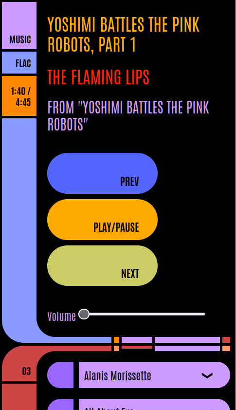

# Brennan TNG

A lightweight web service that lets you control your **Brennan B2** music player from a browser using an interface inspired by the **LCARS** design from *Star Trek: The Next Generation*.

 

The service is deliberately simple - you can play, pause, skip tracks, adjust the volume and play an album. You cannot use it as a replicator.

## Running the service

The service is distributed as a Docker image and requires the URL of your Brennan B2 to be provided as an environment variable.

### Basic command

```bash
docker run -e <url-to-brennan-b2> -p 8080:80 ghcr.io/andrewl/brennan-tng:latest
```

### Example

If your Brennan B2 is available at `http://192.168.0.5`, run:

```bash
docker run -e http://192.168.0.5 -p 8080:80 ghcr.io/andrewl/brennan-tng:latest
```

Then open your browser and navigate to:

```
http://localhost:8080
```

The visual template is based on the LCARS designs from:

**TheLCARS.com**
